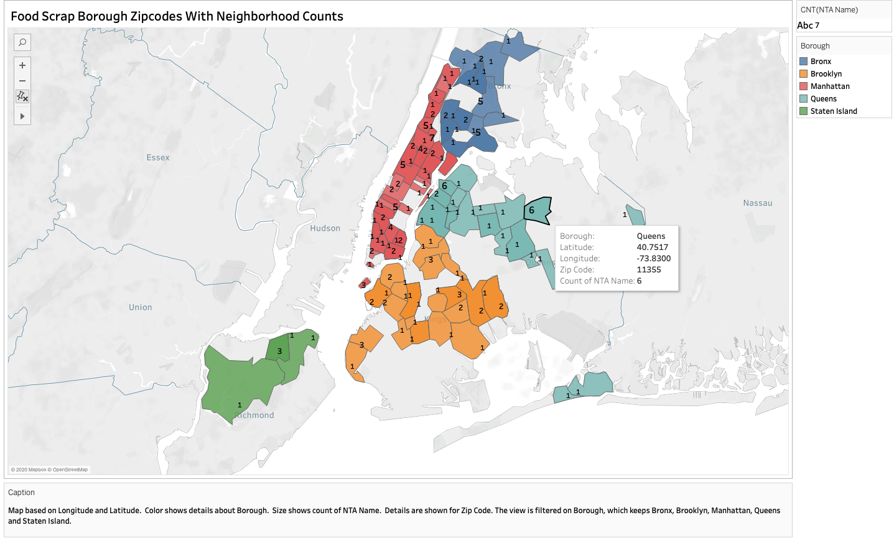
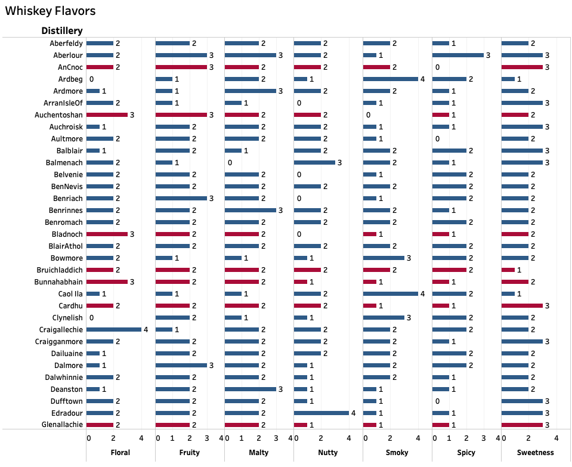
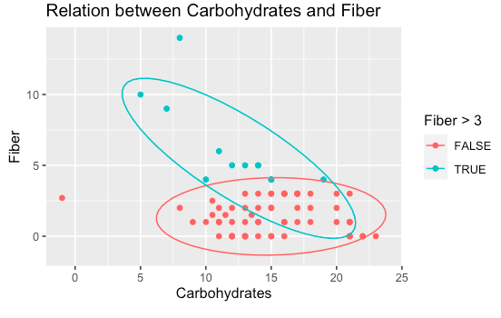
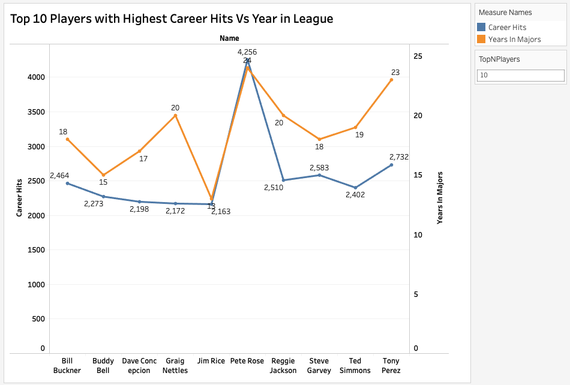
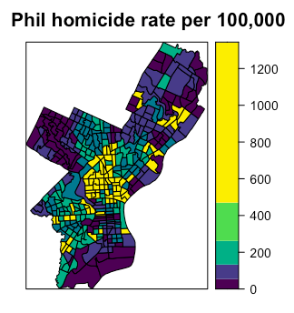
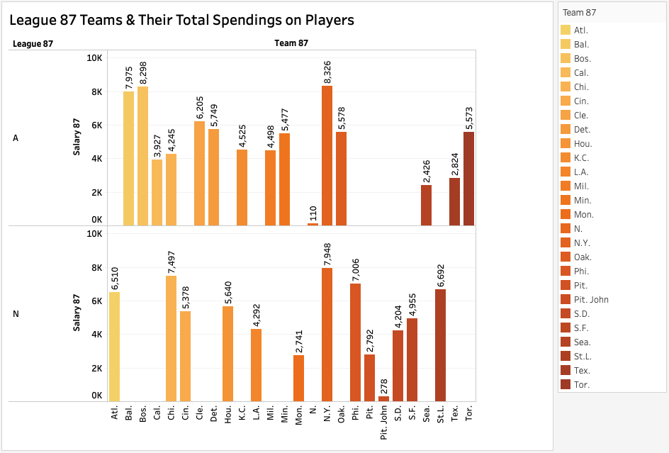
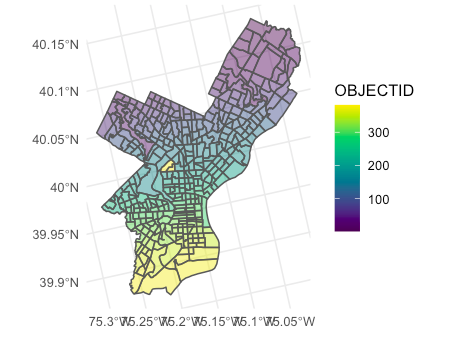

```{r setup, include=FALSE}
library(flexdashboard)
library(knitr) # to create nice documents in R
library(tidyverse) # loads ggplot2, dplyr, tidyr, readr, purr, tibble
library(forcats) # working with categorical variables
```

Row {data-width=700}
-----------------------------------------------------------------------

### Chart A

```{r}

```

Row {data-width=700}
-----------------------------------------------------------------------

### Chart B

```{r}
knitr::include_graphics("Cereal_Relation1.png")
```

### Chart B

```{r}

```

### Chart C

```{r}

```

Row {data-width=700}
-----------------------------------------------------------------------

### Chart E

```{r}

```

Row {data-width=600}
-----------------------------------------------------------------------

### Chart H

```{r}

```

### Chart J

```{r}

```

### Chart G

```{r}

```