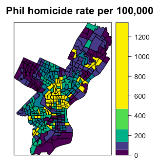

Storyboard {.storyboard}
=========================================
### **Food Scrap Visual**

```{r}
knitr::include_graphics("FoodScrap.png")
```

*** 

* I have collected the data from NYC open data source repository to analyze the Food Scrap drop off location in New York City. 

* The dataset contains the NYC Borough where vendor is located. New York City’s boroughs are five county-level administrative divisions, with each one also being a state county. 

* Neighborhood Tabulation Areas Name are small area boundaries that were initially created by the Department of City Planning for small area population projections. 

* The dataset gives the information about the Latest and earliest hour when food scraps can be dropped off. 

* The Latitude and Longitude of food scrap drop-off location is for mapping purposes. The zip code and Street address or cross streets provides the food scrap drop-off location.

### **Whiskey Distillery Visual**

```{r}
knitr::include_graphics("Anusuya_Tableau_Whiskey_Visuals.png")
```

*** 

* I used bar chart to check the relationship between filtered 37 Distillery and 7 Whiskey parameters. 

* Based on the visualization, I could find the different flavor levels prepared by each distillery. 

* In order to avoid using more than 6 colors for multiple categories, I have chosen blue and red color for representing bars as per visualization standard. The dual color differentiation will help to read the data across different category.

* It is clear from the visuals that spicy flavor is having high range value of 3 for Glen Garioch distillery and Winey flavor is having high range value of 3 for Balmenach distillery. 

* Likewise, I was able to analyze different flavor levels of Whiskey from the visuals for the corresponding distillery.

### **Cereal: Carb Vs Fiber**

```{r}
knitr::include_graphics("Cereal_Relation2.png")
```

*** 

* The dataset contains 77 products which includes 7 manufacturers, and 2 types. 

* While filtering, I found out of 77 products, 3 products belong to hot type which is produced by manufacturers A, N, Q while the rest 74 products are of cold type and manufactured by manufacturers G, K, N, P, Q, R.

* The measurement of different carbohydrates and fiber level is made based on weight and cup level of product, which is not consistent across all products. 

* I recorded the analysis by finding the relationship between carbohydrates and fiber using clusters in data.

### **Cereal: Sugar Vs Calories**

```{r}

```

*** 

* Less than 100 calories in product are manufactured by manufacturer K, N, P, Q, R which is of cold type product has 0g or 1g of fat only.

* All the 3 hot type products are of with 100 calories, among these the product from manufacturer Q has less g and mg of cereal variables when compared with others.

* Out of all manufacturers, G and K manufactures more products with different calories level.

* While filtering the data, I noticed products with high sodium and potassium has high fat and sugar level, whereas if there are less or no sugar and fat then the sodium and potassium level are in less mg level.

* Although there is no relationship between weight measured and cups level, the product variables has difference at different calories level. 

### **Baseball: Top 10 Players Career Hits Vs Years in League**

```{r}
knitr::include_graphics("Baseball1.png")
```

*** 

* In this dual axis line graph, I tried to find the top 10 players with highest career hits with respect to number of years in league.

* For this, I have included Name field in columns shelf, career hits and years in league in rows shelf. Then I filtered the name field to get the top 10 values with respect to career hits. The dual axis option in Tableau helped to find the relationship between career hits and years in league fields.

* I used Tableau parameter to find the TopNPlayers, which will be very helpful to view comparison between career hits and years in league for N number of players, just by giving inputs using parameters. This feature will be helpful for data analyst and business analyst while generating reports. 

* It is clear from the graph, that greater the number of leagues played, higher the career hits value.

### **Baseball: Number of Putouts, Assists, Errors From Each Positions With Respect to League**

```{r}

```

*** 

* In this graph, I tried to find the relationship between number of putouts, assists and errors from each position with respect to league played.

* I included League and position in column shelf, Sum of putouts, assists and errors in row shelf. The different color bar represent the different positions and it is for both A and N league category.

* The bar graph was very helpful to find the best position to score putouts. The scoring technique relationship is found to be in common between both leagues.

* The assists and errors bar show the positions where most of the score loss happens. Based on this, the weaken positions can be strengthened for improving assist and errors.

### **Baseball: League87 Team Salary Spending on Players**

```{r}
knitr::include_graphics("Baseball3.png")
```

*** 

* In this graph, I tried to find the total spending of Team87 on players in League 87. I used bar graph to show the visual representation of Salary87 details.

* I have included Team87 in columns shelf, League87 and sum of Salary87 in rows shelf. The different color indicates the different Team details.

* From this bar graph, it was very clear to extract the total sum of investment or spending on players by different teams87 in league87 game.

* Also, I could find very few teams represented in both A and N league87 match. Most of the team87 has either one of the team played in A league87 or N league87.

* Likewise, I can use the same graph to get maximum salary offered to players by each team87.


### **Homicide Rate**

```{r}

```

*** 

* In this plot, I discretized the continuous variable into 6 levels.

* I tried to find the Phil homicide rate per 100,000

* The continuous variables are discretized into 6 levels based on different categories as indicated in map plot. 

* The different levels of indication are easier for understanding the data and getting the insights from it. 

* According to Information visualization, this decision was made to provide the background information of data in human interpretable format which focuses on color and categorical variable for studying the relationship in data.

### **Leaflet: Homicide Rate**

```{r message=FALSE}
library(sf)
library(RColorBrewer)
library(viridis)
library(leaflet)
library(tmap)

library(knitr) # to create nice documents in R
library(tidyverse) # loads ggplot2, dplyr, tidyr, readr, purr, tibble
library(broom)
library(forcats)
philly_sf <-  st_read("Philly3/Philly3.shp")
ph_WGS = philly_sf %>% st_transform(4326)
pal_fun <- colorQuantile("YlOrRd", NULL, n = 5) # helper function to allow coloring by variable value
p_popup <- paste0("<strong>Homicide Rate: </strong>", ph_WGS$HOMIC_R)
leaflet(ph_WGS) %>%
  addPolygons(
    stroke = FALSE, 
    fillColor = ~pal_fun(HOMIC_R),
    fillOpacity = 0.8, smoothFactor = 0.5,
    popup = p_popup,
    group = "philly") %>%
  addTiles(group = "OSM") %>%
  addProviderTiles("CartoDB.DarkMatter", group = "Carto") %>%
  addProviderTiles("Esri.WorldImagery", group = "Sat") %>%
  addLayersControl(baseGroups = c("OSM", "Carto","Sat"), 
                   overlayGroups = c("philly")) 
```

*** 

* Web mapping with leaflet

* Leaflet makes use of the widely known ‘Leaflet’ JavaScript library, “the leading open-source JavaScript library for mobile-friendly interactive maps”.

* The Leaflet library gives us loads of options to customize the web look and feel of the map.

* Leaflet requires the spatial data to have preassign reference and likes the WGS84 data. So as first step, I will transform the cordinates into that crs.

* To map the homicide rate, I provided several parameters to the addPolygons()

* Set a fillColor for each polygon based on `HOMIC_R` and make it look nice by adjusting fillOpacity and smoothFactor. 

* The fill color is generated using the `colorQuantile()` function, which takes the color scheme and the desired number of classes.

* To add a popup with the `HOMIC_R` values, I created as a vector of strings, that then supply to `addPolygons()`.

* Finally, I have added the control to switch to another basemap and turn the philly polygon off and on.
